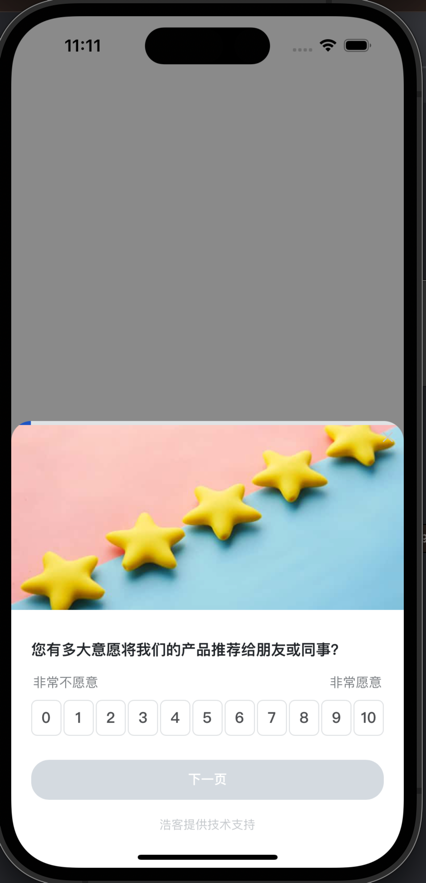

# howxm-ios-OC-demo

- OC项目调用SDK代码示例,示例代码见: OCDemo/ViewController.m
```objective-c++
Howxm *howxm = [[Howxm alloc] init];
[howxm initializeSDK:@"5a406af5-5caa-44f5-b477-95b5d1e5ed9f" :rootViewController :^{
        NSLog(@"initializeSDK success");
        NSLog(@"Initialized: %@", [howxm checkInitialized] ? @"true" : @"false");

        Customer *customer = [[Customer alloc] init:@"uid_001" :@"zuos" :@"zuos@howxm.com" :@"13000000000" :nil];
        [howxm identify:customer :^{
            NSLog(@"identify success");
            [howxm checkOpen:@"8d6d3fb38515f3a966017cd530696bc1" :nil :^{
                NSLog(@"checkOpen success");
            } :^{
                NSLog(@"checkOpen failed");
            }];
            // [howxm open:@"8d6d3fb38515f3a966017cd530696bc1" :nil :nil :nil];
            [howxm event:@"test" :@{@"a": @"1", @"b": @2} :nil :nil :nil];
        } :^{
            NSLog(@"identify failed");
        }];
    } :nil];
```
- 该项目启动后会自动弹出问卷
